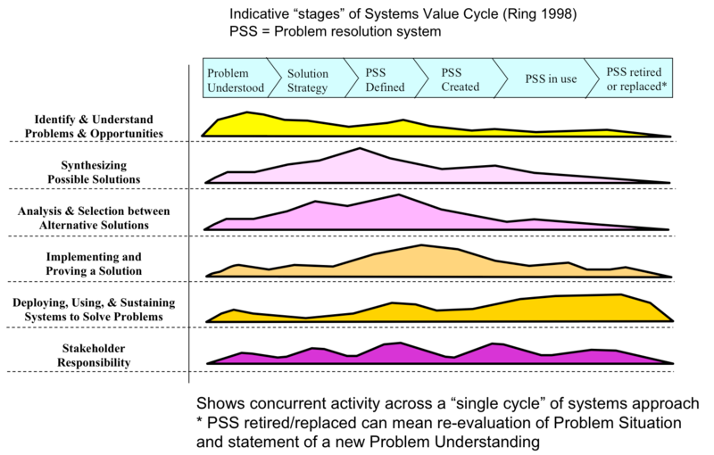

# System Architecture Notebook

## Definitions

| Abbreviation| Definition |
|-----|-----------------------------|
| ADG | Architecture Decision Graph |
|DSM | Design structure matrix |
| FFBD | Functional flow block diagram |
| INCOSE | International Council on Systems Engineering, requires membership? |
| LML | LIFECYCLE MODELING LANGUAGE |
| MDA | Model Driven Architecture |
| MDO | Multidisciplinary Design Optimization |
| MITRE | Massachusetts Institute of Technology Research & Engineering |
| MOSA | Modular Open Systems Approach |
| OMG | Object Management Group |
| OPM | Object-Process Methodology |
| PBSE | Pattern Based System Engineering |
| poset | Partially ordered set |
| SEBoK | Systems Engineering Body of Knowledge |
| STEM | Science, Technology, Engineering, and Mathematics |

SEBoK glossary of terms:
<https://sebokwiki.org/wiki/Category:Glossary_of_Terms>

ISO 42010 Systems and software engineering — Architecture description
ISO/IEC 15288:2008 System lifecycle process
ISO/PAS 19450:2015 Automation systems and integration — Object-Process Methodology

## Requirements

### GOOD REQUIREMENTS

A good requirement states something that is necessary, verifiable, and attainable. Even if it is verifiable and attainable, and eloquently written, if it is not necessary, it is not a good requirement. To be verifiable, the requirement must state something that can be verified by examination, analysis, test, or demonstration. Statements that are subjective, or that contain subjective words, such as "easy", are not verifiable. If a requirement is not attainable, there is little point in writing it. A good requirement should be clearly stated.

__Need.__ If there is a doubt about the necessity of a requirement, then ask: What is the worst thing that could happen if this requirement were not included? If you do not find an answer of any consequence, then you probably do not need the requirement.

__Verification.__ As you write a requirement, determine how you will verify it. Determine the criteria for acceptance. This step will help insure that the requirement is verifiable.

__Attainable.__ To be attainable, the requirement must be technically feasible and fit within budget, schedule, and other constraints. If you are uncertain about whether a requirement is technically feasible, then you will need to conduct the research or studies to determine its feasibility. If still uncertain, then you may need to state what you want as a goal, not as a requirement. Even if a requirement is technically feasible, it may not be attainable due to budget, schedule, or other, e.g., weight, constraints. There is no point in writing a requirement for something you cannot afford -- be reasonable.

__Clarity.__ Each requirement should express a single thought, be concise, and simple. It is important that the requirement not be misunderstood -- it must be unambiguous. Simple sentences will most often suffice for a good requirement.

- Requirements use shall
- Statements of fact use will
- Goals use should.

### requirement challenges

Several challenges associated with requirements include:

- Defining the requirements in a structured, controlled manner.
- Tracing these requirements to system components, aspects, and decisions.
- Testing and verifying compliance of the system with these requirements.

## System principles

Table 1. A Set of Systems Principles. (SEBoK Original)

- __Name__: Statement of Principle
Abstraction A focus on essential characteristics is important in problem solving because it allows problem solvers to ignore the nonessential, thus simplifying the problem (Sci-Tech Encyclopedia 2009; SearchCIO 2012; Pearce 2012).
- __Boundary__:  A boundary or membrane separates the system from the external world. It serves to concentrate interactions inside the system while allowing exchange with external systems (Hoagland, Dodson, and Mauck 2001).
- __Change__: Change is necessary for growth and adaptation, and should be accepted and planned for as part of the natural order of things rather than something to be ignored, avoided, or prohibited (Bertalanffy 1968; Hybertson 2009).
- __Dualism__: Recognize dualities and consider how they are, or can be, harmonized in the context of a larger whole (Hybertson 2009).
- __Encapsulation__: Hide internal parts and their interactions from the external environment (Klerer 1993; IEEE 1990).
- __Equifinality__ In open systems, the same final state may be reached from different initial conditions and in different ways (Bertalanffy 1968). This principle can be exploited, especially in systems of purposeful agents.
- __Holism__: A system should be considered as a single entity, a whole, not just as a set of parts (Ackoff 1979; Klir 2001).
- __Interaction__: The properties, capabilities, and behavior of a system are derived from its parts, from interactions between those parts, and from interactions with other systems (Hitchins 2009 p. 60).
- __Layer Hierarchy__: The evolution of complex systems is facilitated by their hierarchical structure (including stable intermediate forms) and the understanding of complex systems is facilitated by their hierarchical description (Pattee 1973; Bertalanffy 1968; Simon 1996)
- __Leverage__: Achieve maximum leverage (Hybertson 2009). Because of the power versus generality tradeoff, leverage can be achieved by a complete solution (power) for a narrow class of problems, or by a partial solution for a broad class of problems (generality).
- __Modularity__: Unrelated parts of the system should be separated, and related parts of the system should be grouped together (Griswold 1995; Wikipedia 2012a).
- __Network__: The network is a fundamental topology for systems that forms the basis of togetherness, connection, and dynamic interaction of parts that yield the behavior of complex systems (Lawson 2010; Martin et al. 2004; Sillitto 2010).
- __Parsimony__: One should choose the simplest explanation of a phenomenon, the one that requires the fewest assumptions (Cybernetics 2012). This applies not only to choosing a design, but also to operations and requirements.
- __Regularity__: Systems science should find and capture regularities in systems, because those regularities promote systems understanding and facilitate systems practice (Bertalanffy 1968).
- __Relations__: A system is characterized by its relations: the interconnections between the elements. Feedback is a type of relation. The set of relations defines the network of the system (Odum 1994).
- __Separation of Concerns__: A larger problem is more effectively solved when decomposed into a set of smaller problems or concerns (Erl 2012; Greer 2008).
- __Similarity/Difference__: Both the similarities and differences in systems should be recognized and accepted for what they are (Bertalanffy 1975 p. 75; Hybertson 2009). Avoid forcing one size fits all, and avoid treating everything as entirely unique.
- __Stability/Change__: Things change at different rates, and entities or concepts at the stable end of the spectrum can and should be used to provide a guiding context for rapidly changing entities at the volatile end of the spectrum (Hybertson 2009). The study of complex adaptive systems can give guidance to system behavior and design in changing environments (Holland 1992).
- __Synthesis__: Systems can be created by “choosing (conceiving, designing, selecting) the right parts, bringing them together to interact in the right way, and in orchestrating those interactions to create requisite properties of the whole, such that it performs with optimum effectiveness in its operational environment, so solving the problem that prompted its creation” (Hitchins 2009: 120).
- __View__: Multiple views, each based on a system aspect or concern, are essential to understand a complex system or problem situation. One critical view is how concern relates to properties of the whole (Edson 2008; Hybertson 2009).

### Systems engineering principle

- SE Principle A: __The Systems Approach__ - “SE is applied to a system-of-interest (SoI) in a wider systems context”
- SE Principle B: __Synthesis__ - “SE must bring together a collection of parts to create whole system solutions”
- SE Principle C: __Holism__ - “Always consider the consequences on the wider system when making decisions about the system elements”
- SE Principle D: __Organismic Analogy__ - “Always consider systems as having dynamic “living” behavior in their environment”
- SE Principle E: __Adaptive Optimizing__ - “Solve problems progressively over time”
- SE Principle F: __Progressive Entropy Reduction__ - “Continue to make systems work over time, through maintenance, sustainment and, upgrade activities.”
- SE Principle G: __Adaptive Satisfying__ - “A system will succeed only if it makes winners of its success-critical stakeholders, so the lifecycle of a system must be driven by how well its outputs contribute to stakeholder purpose"

### Engineered systems

Generally, four specific types of engineered system contexts are recognized in SE:

- product system
- service system
- enterprise system
- system of systems (SoS) capability

One of the key distinctions between these system contexts pertains to the establishment of how and when the SoI
boundary is drawn.

### Synthesis

The following activities provide an outline for defining the SoI:

- grouping of elements
- identification of the interactions among the elements
- identification of interfaces between elements
- identification of external interfaces to the SoI boundary
- common sub-elements within the SoI boundary

### System analysis principles

- Systems analysis is an iterative activity consisting of trade studies made between various solution options from the systems synthesis activity.
- Systems analysis uses assessment criteria based upon a problem or opportunity system description.
  - These criteria will be based around an ideal system description that assumes a hard system problem context can be defined.
  - The criteria must consider required system behavior and properties of the complete solution in all of the possible wider system contexts and environments.
  - Trade studies require equal consideration to the primary system and the enabling system working as a single system to address the user need. These studies need to consider system requirements for Key Performance Parameters (KPPs), systems safety, security, and affordability across the entire life cycle.
  - This ideal system description may be supported by soft system descriptions from which additional “soft” criteria may be defined (e.g., a stakeholder preference for or against certain kinds of solutions and relevant social, political, or cultural conventions to be considered in the likely solution environment, etc.).
- At a minimum, the assessment criteria should include the constraints on cost and time scales acceptable to stakeholders.
- Trade studies provide a mechanism for conducting analysis of alternative solutions.
  - A trade study should consider a “system of assessment criteria,” designating special attention to the limitations and dependencies between individual criteria.
  - Trade studies need to deal with both objective and subjective criteria. Care must be taken to assess the sensitivity of the overall assessment to particular criteria.

### Lifecycle questions

1. What values do stakeholders want/need?
2. What system outcomes could improve this value?
3. What system can provide these outcomes?
4. How do we create such a system?
5. How do we deploy and use the system to achieve the outcomes?
6. Do these outcomes provide the expected improvement in value?

For the generic systems approach, the following fundamental life cycle principles apply:

- A life cycle has groups of stages which cover understanding stakeholder value; exploration of a problem situation (see System Definition); creation of a system solution (see System Realization); and System Deployment and Use.
- Life cycle processes define a system of engineering and management activities based on the detailed information needed to ensure a systems approach across a life cycle (e.g., requirements, architecture, verification, and validation).
- Activities in any of the processes may be employed in all of the stages to allow for appropriate concurrency.
- The sequence and control of the life cycle stages and concurrent process activities must be tailored to the problem situation and commercial environment (Lawson 2010), thus leading to the selection of an appropriate life cycle model.
- Appropriate management activities must be included in the life cycle to ensure consideration of time, cost, and resource drivers.
- In focusing on the creation of a specific system-of-interest (SoI) to provide solutions within the cycle, it is important to recognize the need to employ the right balance between reductionism and holism by considering the appropriate system context.

### Stakeholder definitions

- The acquirer is the stakeholder that acquires or procures a product or service from a supplier.
- The supplier is an organization or individual that enters into an agreement with the acquirer to supply a product or service.
- The operator is an individual or organization that uses knowledge, skills and procedures to perform the functions of the system to provide the product or service.
- The user or customer is the individual or group that benefit from the operation of the system.
